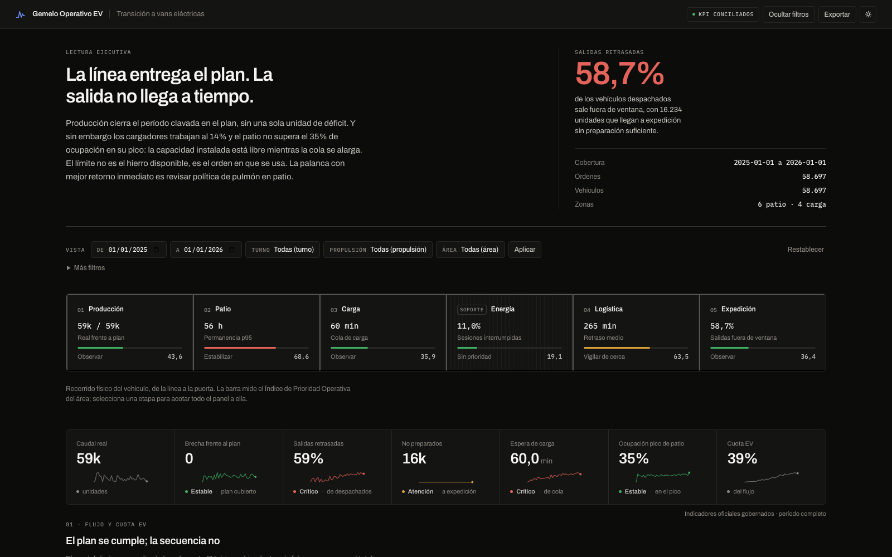
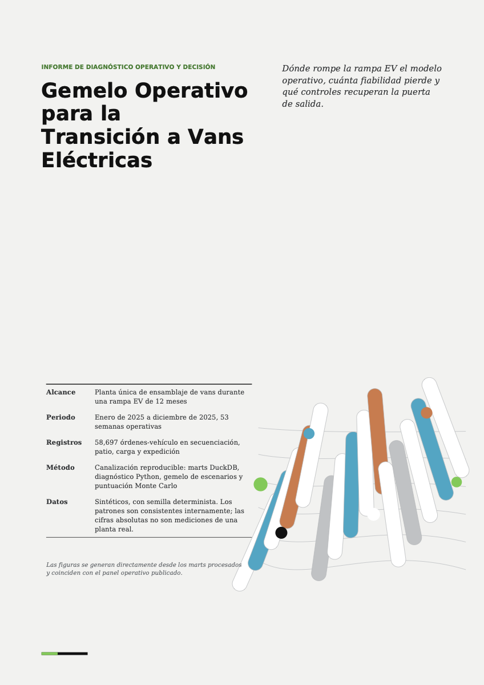
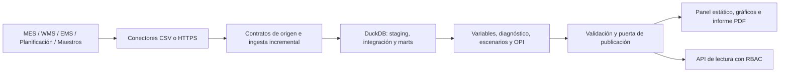

<div align="center">

# Gemelo Operativo para la Transición a Vans Eléctricas

**Gemelo operativo reproducible que localiza dónde se rompe el flujo durante una rampa de producción EV,<br>cuantifica el impacto y ordena las palancas que lo recuperan — de dato sintético a decisión.**

[](https://github.com/mfidalgomartins/gemelo-operativo-industrial-ev-vans/actions/workflows/ci.yml)
[](pyproject.toml)
[](.github/workflows/ci.yml)
[](outputs/reports/release_readiness.json)
[](LICENSE)

[](https://mfidalgomartins.github.io/gemelo-operativo-industrial-ev-vans/)
[](https://mfidalgomartins.github.io/gemelo-operativo-industrial-ev-vans/outputs/reports/ev_transition_operating_twin_report.pdf)

</div>

<table>
<tr>
<td width="50%" valign="top">

### 📊 Panel operativo — la experiencia analítica principal

[**Abrir el Dashboard en Vivo →**](https://mfidalgomartins.github.io/gemelo-operativo-industrial-ev-vans/)

[](https://mfidalgomartins.github.io/gemelo-operativo-industrial-ev-vans/)

</td>
<td width="50%" valign="top">

### 📄 Informe analítico — el entregable de apoyo a decisión

[**Leer el Informe Analítico →**](https://mfidalgomartins.github.io/gemelo-operativo-industrial-ev-vans/outputs/reports/ev_transition_operating_twin_report.pdf)

[](https://mfidalgomartins.github.io/gemelo-operativo-industrial-ev-vans/outputs/reports/ev_transition_operating_twin_report.pdf)

</td>
</tr>
</table>

## Resumen ejecutivo

| | |
|---|---|
| **Alcance** | 58.697 vehículos · 14 tablas operativas · 12 meses de rampa, desde el 1 de enero de 2025 |
| **Hallazgo principal** | La producción cierra el período clavada en el plan; el **58,7 %** de las salidas queda fuera de ventana — el cuello de botella está en preparación y expedición, no en la línea |
| **Prioridad operativa** | `LOGISTICA` y `PATIO` lideran el ranking OPI, estable en el **77,33 %** de las simulaciones Monte Carlo |
| **Recomendación** | Paquete correctivo de secuenciación, carga y gestión de patio — impacto y compensaciones cuantificados en el motor de escenarios |
| **Estado de publicación** | **Aprobado** (`PASS`), sin incidencias materiales, alcance explícito de **apoyo a decisión** |

## Por qué existe este proyecto

Una planta en rampa EV no falla de forma visible en el KPI que todos miran primero. La producción puede cerrar el período clavada en el plan mientras la salida se retrasa, los cargadores trabajan muy por debajo de capacidad y el patio se convierte en un embudo silencioso. Este gemelo operativo existe para hacer esa brecha visible, medible y accionable: conecta el recorrido físico del vehículo — producción, patio, carga, logística y expedición — con un índice de prioridad único que dice qué área intervenir primero y por qué.

No es un cuadro de mando descriptivo. Es un sistema de decisión con tres compromisos explícitos:

- **Todo es reproducible.** La misma semilla determinista produce el mismo corte de datos, el mismo panel y el mismo informe, byte a byte.
- **Todo declara sus límites.** Los datos son sintéticos, las elasticidades de escenario son supuestos paramétricos salvo que exista calibración aprobada, y el sistema nunca se presenta como algo distinto de apoyo a decisión.
- **Nada se publica sin pasar la puerta.** `ev-twin release-check` bloquea la publicación ante cualquier fallo crítico, discrepancia de KPI o artefacto que no coincida con su manifiesto — fail-closed, sin excepción manual.

## Los dos entregables estrella

### El panel: la experiencia interactiva principal

`outputs/dashboard/industrial-ev-operating-command-center.html` es un artefacto HTML estático — sin backend, sin paso de construcción para quien lo abre — pensado para lectura ejecutiva en menos de un minuto y para exploración analítica en profundidad cuando hace falta.

- **Lectura ejecutiva en el primer scroll**: veredicto en una frase, cifra que lo sostiene y cobertura del corte, antes de cualquier gráfico.
- **Espina de flujo física**: producción → patio → carga → logística → expedición, cada etapa con su métrica característica y su Índice de Prioridad Operativa; seleccionarla acota todo el panel a esa área.
- **19 gráficos Chart.js** organizados en caudal y cuota EV, patio y carga, riesgo y expedición, escenarios de decisión y diagnóstico EV/ICE.
- **Banda de 7 KPI gobernados**, con serie temporal y estado frente a umbral — y una regla de gobierno explícita: sobre el corte completo se muestran los valores oficiales de `kpi_operativos.csv`, no un recálculo en cliente.
- **8 filtros interactivos** (fecha, turno, propulsión, versión, área, zona de patio, zona de carga, severidad), aplicados en el cliente sin llamadas a servidor.
- **Sistema de diseño auditado**: color semántico y fijo (nunca decorativo), sin dobles ejes, estado siempre acompañado de texto, tabla equivalente para cada serie, paleta verificada contra contraste y daltonismo en modo claro y oscuro.

Guía completa de uso y lectura recomendada: [docs/dashboard_usage.md](docs/dashboard_usage.md) · Arquitectura y contratos de diseño: [docs/dashboard_architecture.md](docs/dashboard_architecture.md).

### El informe: el entregable de apoyo a decisión

`outputs/reports/ev_transition_operating_twin_report.pdf` traduce el mismo corte de datos a un documento de diagnóstico y decisión, con la disciplina editorial de un informe de consultoría: tablas que no se parten entre páginas, encabezados vinculados a su contenido, apéndice técnico completo y metadatos deterministas que hacen el PDF byte-estable entre reconstrucciones idénticas.

- Diagnóstico por área, turno, versión de vehículo y propulsión, con el motor causal detrás de cada cuello de botella.
- Comparación EV frente a ICE y tendencia de transición a lo largo de las tres fases de rampa.
- Motor de escenarios paramétrico con comparación base vs. paquete de medidas correctivas.
- Ranking de palancas de intervención con sensibilidad de pesos y prueba de estabilidad Monte Carlo.
- Apéndice de trazabilidad: fórmulas, grano y límites de uso de cada métrica citada.

## Qué pregunta responde cada salida

Los datos sintéticos modelan tres fases de transición, desde pre-serie hasta estabilización, y conectan cada orden con su recorrido por producción, patio, carga, preparación y salida.

| Pregunta de decisión | Salida principal |
|---|---|
| ¿Dónde se rompe el flujo? | Diagnóstico por área, turno, versión y vehículo |
| ¿Qué presión introduce la cuota EV? | Comparación EV/ICE y tendencia de transición |
| ¿Qué intervención priorizar? | Índice de Prioridad Operativa (OPI), sensibilidad y Monte Carlo |
| ¿Qué capacidad o regla cambiar? | Comparador paramétrico de escenarios |
| ¿Se puede publicar el resultado? | Puerta de publicación con contratos de datos, KPI y panel |

## Cómo funciona



1. Un generador determinista crea órdenes, activos, restricciones y eventos operativos sintéticos (o los conectores CSV/HTTPS ingieren datos reales bajo los mismos contratos).
2. Once scripts DuckDB construyen preparación SQL, vistas integradas, marts, KPI y comprobaciones de negocio.
3. Python calcula variables, diagnóstico, escenarios paramétricos y el Índice de Prioridad Operativa (OPI).
4. Sensibilidad de pesos y Monte Carlo prueban la estabilidad del ranking.
5. La puerta de publicación valida integridad, consistencia de métricas, SLA y contratos del panel antes de liberar cualquier artefacto.

Los KPI oficiales provienen de `data/processed/ev_factory/kpi_operativos.csv`. `area_throughput_loss_proxy` atribuye impacto a eventos de cuello de botella, pero no representa una estimación causal. El paquete también incluye contratos de ingesta incremental, conectores CSV/HTTPS, linaje, observabilidad, calibración opcional y una API de lectura con RBAC — arquitectura completa en [docs/system_architecture.md](docs/system_architecture.md).

## Ejecución local

```bash
python3 -m venv .venv
source .venv/bin/activate
python -m pip install -e ".[dev,service]"

ev-twin run --generate-data --seed 20260328 --months 12
ev-twin artifacts
ev-twin release-check
```

Los CSV de origen, marts, base DuckDB y estado operacional son reconstruibles y no se versionan. Los comandos anteriores recrean el corte canónico de forma determinista. El panel, los 19 gráficos y el informe PDF sí permanecen publicados para revisión inmediata del portafolio.

Para una guía operativa con orden real de la canalización, comandos parciales, salidas esperadas y resolución de problemas: [docs/operator_quickstart.md](docs/operator_quickstart.md).

## Verificación

```bash
ruff check .
ruff format --check .
pytest -q
pytest -q -m integration
ev-twin release-check
```

La CI ejecuta Python 3.10 y 3.12, lint, formato, unitarios, integración, cobertura mínima del 85 %, build de wheel/sdist, instalación aislada del wheel, Bandit y auditoría estricta de dependencias.

## Estructura

```text
src/gemelo_operativo_ev/      paquete instalable, CLI, API y canalización
  ingestion/                  contratos, conectores e incremental idempotente
  sql/ev_factory/             11 transformaciones DuckDB empaquetadas
  dashboard/                  plantilla y renderer del panel oficial
  reporting/                  generación de 19 gráficos y del informe PDF
  synthetic_data_gen/         generador determinista de datos sintéticos
tests/                        pruebas unitarias, integración y contratos públicos
docs/                         arquitectura, métricas, metodología y gobernanza
  governance/                 contrato de gobernanza de KPI y puertas de release
outputs/dashboard/             panel HTML publicado en GitHub Pages
outputs/graphs/                19 gráficos analíticos curados
outputs/reports/               informe PDF, manifiesto de release y preparación de publicación
  pipeline_audit/               trazas intermedias por etapa: auditoría de datos, sumarios SQL,
                                 diagnóstico, escenarios, puntuación y validación
```

## Documentación

| Para quién | Documento |
|---|---|
| Ejecutivo o revisor | Este README + [panel](https://mfidalgomartins.github.io/gemelo-operativo-industrial-ev-vans/) + [informe PDF](https://mfidalgomartins.github.io/gemelo-operativo-industrial-ev-vans/outputs/reports/ev_transition_operating_twin_report.pdf) |
| Quiere ejecutar la canalización | [operator_quickstart.md](docs/operator_quickstart.md) · [production_operations.md](docs/production_operations.md) |
| Quiere entender la arquitectura | [system_architecture.md](docs/system_architecture.md) · [sql_architecture.md](docs/sql_architecture.md) |
| Quiere leer el panel | [dashboard_usage.md](docs/dashboard_usage.md) · [dashboard_architecture.md](docs/dashboard_architecture.md) |
| Quiere auditar una métrica | [sql_metric_definitions.md](docs/sql_metric_definitions.md) · [feature_dictionary.md](docs/feature_dictionary.md) |
| Quiere entender el diagnóstico y la puntuación | [diagnostic_framework.md](docs/diagnostic_framework.md) · [scoring_framework.md](docs/scoring_framework.md) |
| Quiere entender los escenarios | [scenario_model.md](docs/scenario_model.md) |
| Quiere conocer los límites de los datos | [data_contracts_and_caveats.md](docs/data_contracts_and_caveats.md) · [synthetic_generator_logic.md](docs/synthetic_generator_logic.md) |
| Gobierno y publicación | [kpi_governance_contract.md](docs/governance/kpi_governance_contract.md) · [release_gates.md](docs/governance/release_gates.md) |
| Estándar de calidad del repositorio | [repository_quality_standard.md](docs/repository_quality_standard.md) |
| Contribuir, seguridad, comunidad | [CONTRIBUTING.md](CONTRIBUTING.md) · [SECURITY.md](SECURITY.md) · [CODE_OF_CONDUCT.md](CODE_OF_CONDUCT.md) · [CHANGELOG.md](CHANGELOG.md) |

## Hoja de ruta

- **Calibración conectada por defecto**: pasar de elasticidades paramétricas a coeficientes calibrados como camino recomendado en despliegues con histórico real, no solo como extra opcional.
- **Panel con fuente de datos conectable**: mantener el HTML estático como artefacto de portafolio y añadir una variante que lea directamente de la API de lectura para operación en vivo.
- **Ampliación del catálogo de conectores**: sumar orígenes MES/WMS adicionales sobre los mismos contratos de ingesta ya certificados.

## Salidas principales

| Salida | Ruta |
|---|---|
| Panel oficial | `outputs/dashboard/industrial-ev-operating-command-center.html` |
| Informe PDF | `outputs/reports/ev_transition_operating_twin_report.pdf` |
| KPI gobernados (generado) | `data/processed/ev_factory/kpi_operativos.csv` |
| Priorización OPI (generada) | `data/processed/ev_factory/operational_prioritization_table.csv` |
| Escenarios (generados) | `data/processed/ev_factory/scenario_table.csv` |
| Preparación de publicación | `outputs/reports/release_readiness.json` |

## Límites de uso

- Los datos son sintéticos y no representan una planta real.
- Sin un fichero de calibración aprobado, las elasticidades de escenarios son supuestos paramétricos, no estimaciones causales.
- Pesos, umbrales, restricciones y capacidad requieren calibración antes de uso operacional.
- El sistema sirve para arquitectura analítica, diagnóstico y apoyo a decisión; no para compromisos de inversión sin validación independiente.
- El panel es estático, pero carga Chart.js y fuentes web desde CDN.

Licencia: [MIT](LICENSE) · Cómo citar este proyecto: [CITATION.cff](CITATION.cff).
