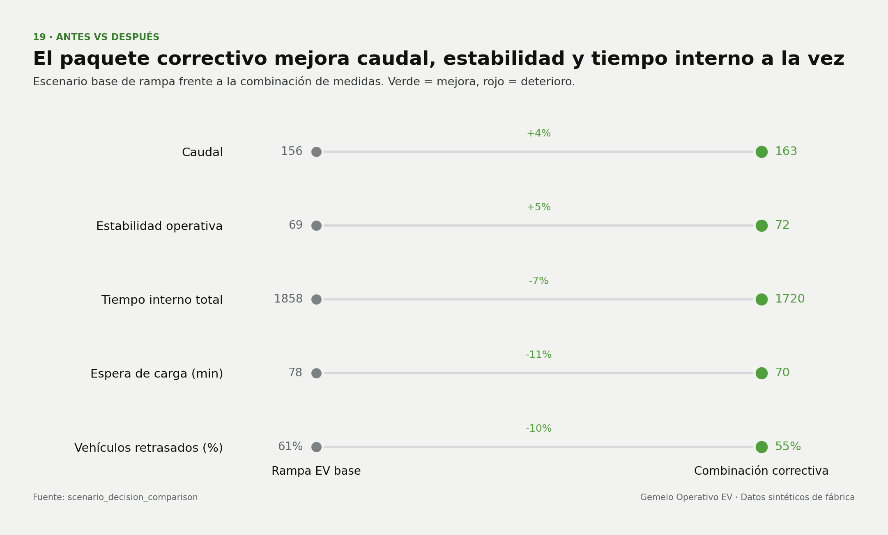

# Gemelo Operativo para la Transición a Vans Eléctricas

Gemelo operativo reproducible que identifica dónde se rompe el flujo durante un ramp-up EV, cuánto cuesta y qué levers lo recuperan.

| | |
|---|---|
| **Dashboard interactivo** | [Abrir dashboard](https://mfidalgomartins.github.io/gemelo-operativo-industrial-ev-vans/) |
| **Informe analítico (PDF)** | [Descargar informe](https://mfidalgomartins.github.io/gemelo-operativo-industrial-ev-vans/outputs/reports/ev_transition_operating_twin_report.pdf) |



## Alcance analítico

El snapshot publicado cubre **58.697 vehículos**, **14 tablas operativas** y **13 meses**, desde el **1 de enero de 2025** hasta el **1 de enero de 2026**. Los datos sintéticos modelan tres fases de transición, desde pre-serie hasta estabilización, y conectan cada orden con su recorrido por producción, patio, carga, readiness y salida.

| Pregunta de decisión | Salida principal |
|---|---|
| ¿Dónde se rompe el flujo? | Diagnóstico por área, turno, versión y vehículo |
| ¿Qué presión introduce el mix EV? | Comparación EV/ICE y tendencia de transición |
| ¿Qué intervención priorizar? | Operational Priority Index, sensibilidad y Monte Carlo |
| ¿Qué capacidad o regla cambiar? | Comparador paramétrico de escenarios |
| ¿Se puede publicar el resultado? | Release gate con contratos de datos, KPI y dashboard |

## Resultados publicados

- El throughput se mantiene cerca del plan, pero readiness y expedición concentran el riesgo operativo.
- `LOGISTICA` y `PATIO` lideran la priorización OPI; el ranking top-1 es estable en **77,33%** de las simulaciones Monte Carlo.
- El paquete correctivo combina secuenciación, carga y gestión de patio para mejorar throughput, estabilidad y tiempo interno.
- El release actual está en **PASS**, sin issues materiales, y limitado explícitamente a **decision-support only**.

## Metodología

1. Un generador determinista crea órdenes, activos, restricciones y eventos operativos sintéticos.
2. Once scripts DuckDB construyen staging, vistas integradas, marts, KPI y checks de negocio.
3. Python calcula features, diagnóstico, escenarios paramétricos y el Operational Priority Index.
4. Sensibilidad de pesos y Monte Carlo prueban la estabilidad del ranking.
5. El release gate valida integridad, consistencia de métricas y contratos del dashboard.

Los KPI oficiales provienen de `data/processed/ev_factory/kpi_operativos.csv`. `area_throughput_loss_proxy` atribuye impacto a eventos de bottleneck, pero no representa una estimación causal.

## Ejecución local

```bash
python3 -m venv .venv
source .venv/bin/activate
python -m pip install -e ".[dev]"

generate-data --seed 20260328 --start-date 2025-01-01 --months 12
python -m src.run_pipeline
python scripts/generate_chart_pack.py
python scripts/generate_report.py
python -m src.ev_release_gate
```

El repositorio incluye un snapshot canónico de los CSV raw, marts y la base DuckDB. Los comandos anteriores regeneran los datos y artefactos de forma determinista.

## Verificación

```bash
ruff check .
ruff format --check .
pytest -q
pytest -q -m integration
python -m src.ev_release_gate
```

## Estructura

```text
data/raw/ev_factory/          14 tablas sintéticas de origen
data/processed/ev_factory/    marts, features, scores y KPI gobernados
sql/ev_factory/               11 transformaciones DuckDB ordenadas
src/                          pipeline, diagnóstico, escenarios y release gate
scripts/                      generación de 19 gráficos y del informe PDF
tests/                        tests unitarios, integración y contratos públicos
docs/                         arquitectura, métricas, metodología y gobernanza
outputs/dashboard/            dashboard HTML publicado en GitHub Pages
outputs/graphs/               gráficos analíticos curados
outputs/reports/              informe, manifests y validaciones
```

## Límites de uso

- Los datos son sintéticos y no representan una planta real.
- Las elasticidades de escenarios son supuestos paramétricos, no estimaciones causales.
- Pesos, umbrales, restricciones y capacidad requieren calibración antes de uso operacional.
- El sistema sirve para arquitectura analítica, diagnóstico y apoyo a decisión; no para compromisos de inversión sin validación independiente.
- El dashboard es estático, pero carga Chart.js y fuentes web desde CDN.

Detalles técnicos: [arquitectura SQL](docs/sql_architecture.md), [definiciones de métricas](docs/sql_metric_definitions.md), [scoring](docs/scoring_framework.md), [gobernanza de KPI](docs/governance/kpi_governance_contract.md) y [release gates](docs/governance/release_gates.md).

Licencia: [MIT](LICENSE).
