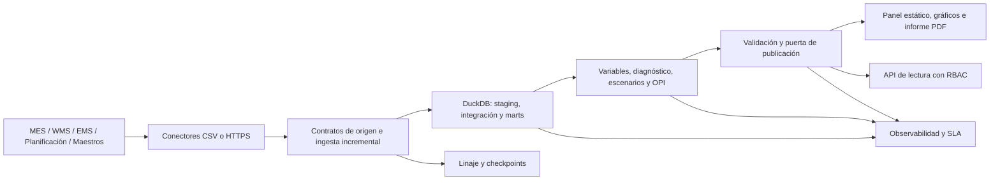

# Arquitectura del Sistema

## Objetivo operativo

El sistema transforma eventos de MES, WMS, EMS, planificación y datos maestros en un corte analítico gobernado, escenarios de decisión y artefactos publicables. El modo sintético y el modo conectado comparten contratos, transformaciones y puertas de calidad.

## Componentes

| Componente | Responsabilidad | Contrato de salida |
|---|---|---|
| `ingestion/` | Extracción completa o incremental, validación y publicación idempotente | 14 CSV de origen, checkpoints y manifiesto de linaje |
| `src/gemelo_operativo_ev/sql/ev_factory/` | Preparación, integración, marts, KPI y controles de negocio | DuckDB reconstruible y CSV procesados |
| capas analíticas | Variables, diagnóstico, escenarios y priorización | Tablas analíticas con grano explícito |
| `calibration.py` | Estimación de elasticidades con efectos fijos y errores agrupados | Matriz completa métrica-palanca aprobada |
| `ev_validate_project.py` | Integridad técnica, reconciliación de KPI y límites analíticos | informe de validación y `release_readiness.json` |
| `ev_release_gate.py` | Decisión fail-closed de publicación | aprobación o bloqueo trazable |
| `api/` | Salud, estado, KPI, prioridades, linaje y comprobación de release | respuestas tipadas y protegidas por rol |
| `observability.py` | Duración por etapa, error tipado y evaluación de SLA | manifiesto JSON por ejecución |
| `reporting/` y `dashboard/` | Entregables de portfolio | HTML, PNG y PDF deterministas |

## Límites y estado

- `data/raw/` y `data/processed/` son estado reconstruible y no se versionan.
- `.ev_twin/` guarda locks, checkpoints, linaje y observabilidad; tampoco se versiona.
- `outputs/dashboard/`, `outputs/graphs/` y el informe PDF son artefactos publicados del portfolio.
- `EV_TWIN_HOME` permite ejecutar el paquete instalado fuera del checkout y fija la raíz de datos y outputs.
- La plantilla del panel y los once scripts SQL forman parte del wheel mediante recursos de paquete.

## Propiedades de producción

- Contratos cerrados: columnas desconocidas, claves nulas/duplicadas y timestamps inválidos bloquean la ingesta.
- Reejecución segura: el incremental aplica lookback, deduplica por clave y solo avanza checkpoints tras publicar todos los lotes validados.
- Exclusión mutua: ingesta y canalización rechazan ejecuciones concurrentes sobre el mismo estado.
- Publicación fail-closed: un fallo crítico, una discrepancia de KPI o un hash de panel no reconciliado impide aprobar el release.
- Evidencia explícita: los escenarios declaran si proceden de priors paramétricos o de calibración aprobada.

## Escalado previsto

DuckDB y CSV son adecuados para este portfolio y para lotes de escala moderada. Si el volumen o la concurrencia exigen un salto de arquitectura, se mantienen los mismos contratos y se sustituyen tres fronteras: almacenamiento de origen por objetos versionados, marts por un almacén SQL y estado local por un servicio transaccional. La API no contiene lógica analítica, por lo que puede escalar independientemente como capa de lectura.
